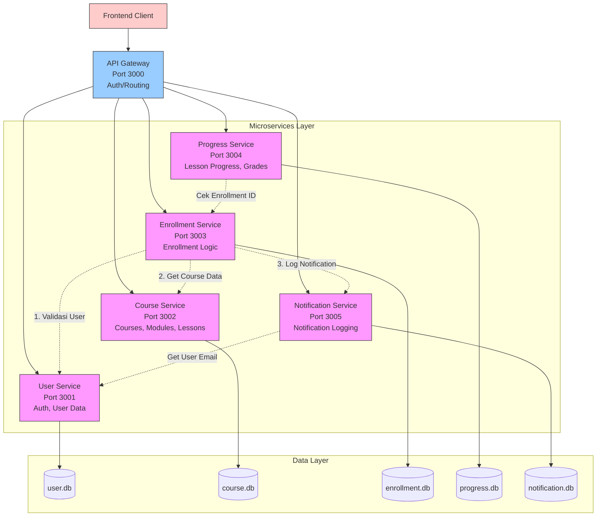
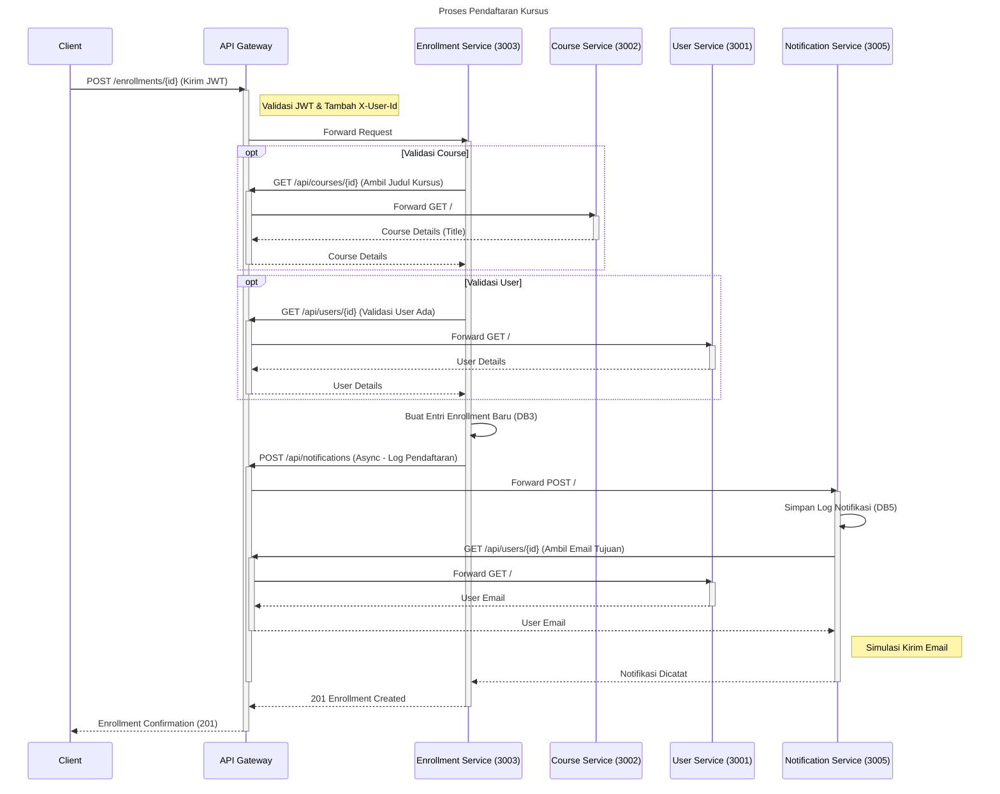

# EduConnect Microservices

## Deskripsi Proyek  

EduConnect Microservices adalah platform berbasis mikroservis yang dirancang untuk menyediakan solusi manajemen pendidikan terintegrasi, dengan berbagai layanan yang terpisah namun saling terhubung untuk menangani berbagai aspek seperti manajemen pengguna, kursus, pendaftaran, progres, dan notifikasi. EduConnect bertujuan untuk memberikan pengalaman belajar yang lebih efisien dan terorganisir melalui penggunaan arsitektur mikroservis, yang memungkinkan skalabilitas dan fleksibilitas dalam pengelolaan layanan pendidikan.

**Fitur Utama:**
- User Service
  Menangani autentikasi pengguna, pendaftaran, dan pengelolaan data pengguna. Layanan ini memastikan bahwa setiap pengguna dapat mengakses platform dengan aman dan mengelola data pribadi mereka    dengan efisien.
- Course Service
  Menyediakan fitur untuk mengelola kursus, modul, dan pelajaran. Admin dapat membuat dan mengelola konten kursus, sedangkan pengguna dapat memilih dan mengikuti kursus sesuai dengan minat dan kebutuhan mereka.
- Enrollment Service
Mengelola proses pendaftaran kursus oleh pengguna. Layanan ini memverifikasi status pendaftaran dan mengatur alur pendaftaran kursus secara otomatis sesuai dengan kebijakan yang telah ditetapkan.
- Progress Service
Menyimpan dan mengelola data progres belajar pengguna, termasuk kemajuan dalam setiap modul dan penilaian dari tugas atau ujian. Hal ini memungkinkan pengguna untuk melacak perkembangan mereka dan mendapatkan umpan balik terkait kinerja mereka.
- Notification Service
Menangani pengiriman notifikasi kepada pengguna. Layanan ini memastikan bahwa pengguna mendapatkan pemberitahuan terkait status pendaftaran mereka, pembaruan kursus, atau informasi penting lainnya secara real-time.

**Keunggulan:**

- Scalability: Layanan-layanan ini dapat diskalakan secara independen untuk menangani jumlah pengguna yang lebih besar dan lebih banyak data.
- Modular: Setiap komponen dapat diperbarui atau dimodifikasi tanpa mempengaruhi komponen lain dalam sistem.
- Resilience: Dengan arsitektur berbasis mikroservis, sistem dapat mengatasi kegagalan pada salah satu layanan tanpa mempengaruhi keseluruhan sistem.
- Ease of Maintenance: Pemisahan fungsionalitas ke dalam layanan terpisah membuat pemeliharaan dan pengembangan lebih mudah dan lebih terorganisir.

EduConnect adalah solusi modern untuk platform manajemen pendidikan yang dapat diterapkan di berbagai jenis lembaga pendidikan, mulai dari universitas hingga pelatihan profesional, memberikan pengalaman pengguna yang lebih baik dan manajemen kursus yang lebih efisien.

---

## Arsitektur Sistem

**Diagram Arsitektur Umum**  

**Alur Komunikasi: EduConnect** 

# Cara Menjalankan
## Setup Awal:
1. Masuk ke ke salah satu folder, misal folder API-Gateway
2. Buka terminal di VS Code atau terminal yang sedang di direktori folder yang ingin disetup
3. Jalankan perintah `npm install` (jika tidak bisa berarti Anda belum menginstall Node.js)
4. Jika berhasil, akan terbuat folder **node_modules** dan file **package-lock.json**
5. Kembali ke step 1 dengan folder yang berbeda (Folder yang harus di setup: **api-gateway**, **course-service**, **enrollment-service**, **notification-service**, **progress-service**, dan **user-service**) 
## Urutan Start: (Bisa menggunakna **start-all.bat** yang disediakan)
1. Mulai dengan menjalankan API Gateway di Port 3000
2. Kemudian jalankan semua microservices di port yang telah ditentukan (3001-3005) dengan perintah berikut `npm run dev` (Jika pada terminal service Notification tidak berjalan karena error, coba jalankan perintah berikut `npm install axios` lalu jalankan kembali dengan menggunakan perintah `npm run dev`)
5. Terakhir, jalankan frontend client
   `npx serve -l 5000`

## Port yang Digunakan:
1. API Gateway: Port 3000
2. User Service: Port 3001
3. Course Service: Port 3002
4. Enrollment Service: Port 3003
5. Progress Service: Port 3004
6. Notification Service: Port 3005

## Variabel ENV yang Perlu Diset:
1. API-Gateway: (Bisa langsung gunakan **.env.example** yang ada pada folder service dengan cara mengubah nama **.env.example** -> **.env**)
   - PORT: 3000
   - JWT_SECRET: rahasia_super_aman_ganti_ini **(atau ganti sesuai keiinginan)**
   - CORS_ORIGIN: http://localhost:5000
   - USER_SERVICE_URL: http://localhost:3001
   - COURSE_SERVICE_URL: http://localhost:3002
   - ENROLLMENT_SERVICE_URL: http://localhost:3003
   - PROGRESS_SERVICE_URL: http://localhost:3004
   - NOTIFICATION_SERVICE_URL: http://localhost:3005
   - NODE_ENV: development **(Sesuaikan)**
3. Course-Service: (Bisa langsung gunakan **.env.example** yang ada pada folder service dengan cara mengubah nama **.env.example** -> **.env**)
   - PORT: 3002
   - DATABASE_URL: sqlite:./course.db
   - NODE_ENV: development
5. Enrollment-Service: (Bisa langsung gunakan **.env.example** yang ada pada folder service dengan cara mengubah nama **.env.example** -> **.env**)
   - PORT: 3003
   - API_GATEWAY_URL: http://localhost:3000
   - DATABASE_URL: sqlite:./enrollment.db
   - NODE_ENV: development
7. Notification-Service: (Bisa langsung gunakan **.env.example** yang ada pada folder service dengan cara mengubah nama **.env.example** -> **.env**)
   - PORT: 3005
   - API_GATEWAY_URL: http://localhost:3000
   - DATABASE_URL: sqlite:./notification.db
   - NODE_ENV: development
9. Progress-Service: (Bisa langsung gunakan **.env.example** yang ada pada folder service dengan cara mengubah nama **.env.example** -> **.env**)
   - PORT: 3004
   - API_GATEWAY_URL: http://localhost:3000
   - DATABASE_URL: sqlite:./progress.db
   - NODE_ENV: development
11. User-Service: (Bisa langsung gunakan **.env.example** yang ada pada folder service dengan cara mengubah nama **.env.example** -> **.env**)
   - PORT: 3001
   - JWT_SECRET: rahasia_super_aman_ganti_ini **(atau ganti sesuai keiinginan)**
   - DATABASE_URL: sqlite:./user.db
   - NODE_ENV: development

# Anggota & Peran
| Nama                        | Peran/Service                     |
|-----------------------------|-----------------------------------|
| ADHIRA ZHAFIF DWICAHYO      | Progress Service                  |
| FAYYADL AHSAN AMALA         | User Service                      |
| TB. ALTA ULIL ABSHOR        | Course Service                    |
| RAFFI AKBAR FIRDAUS         | Enrollment Service                |  

# Ringkasan Endpoint & Dokumentasi API
## User Service
| Method  |         Endpoint          |         Deskripsi         |
|---------|---------------------------|---------------------------|
|  GET    |       `npm run`    |           Test            |

---

## Course Service
| Method  |         Endpoint          |         Deskripsi         |
|---------|---------------------------|---------------------------|
|  GET    |       `npm run `    |           Test            |

---

## Progress Service
| Method  |         Endpoint          |         Deskripsi         |
|---------|---------------------------|---------------------------|
|  GET    |       `npm run`    |           Test            |

---

## Enrollment Service
| Method  |         Endpoint          |         Deskripsi         |
|---------|---------------------------|---------------------------|
|  GET    |       `npm run`    |           Test            |

---

# API Gateway
| Method  |         Endpoint          |         Target         |
|---------|---------------------------|---------------------------|
|  GET    |       `npm run nigeeeerrrrrrrrr`    |           Test            |

